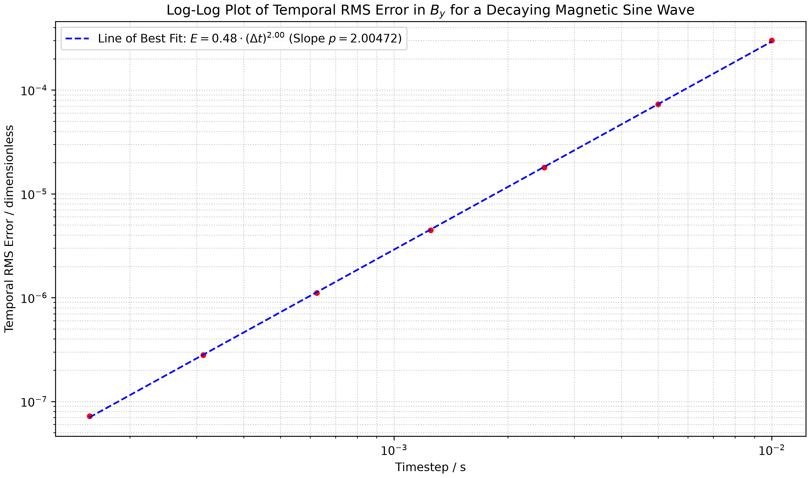

<div align="center">

# Magnetohydrodynamics Simulator


</div>

## Overview

A high-performance, compressible, resistive 2D Magnetohydrodynamics (MHD) Simulator. Its engine built in C++ and visualisation carried out in python. The solver models non-linear plasma interactions, shock dynamics and their evolution over time by coupling high-order finite volume spatial discretisations with a divergence-free field constraint as well as a multi-stage IMEX time integrator.

## Description of Technical Architecture 

| Component | Numerical Scheme / Architecture | Engineering Motivation |
| :--- | :--- | :--- |
| **Grid & Memory Layout** | Staggered Mesh (CT), Struct of Arrays (SoA) | Enforces face-centered magnetic flux while maximising CPU cache locality for vectorisation. |
| **Spatial Reconstruction** | 2nd-Order TVD MUSCL (Minmod Limiter) | Prevents non-physical oscillations across steep gradients and shock fronts. |
| **Riemann Flux Solver** | HLL Approximate Riemann Solver | Resolves non-linear intermediate wave states without expensive full-eigensystem solves. |
| **Divergence Constraint** | Upwind Constrained Transport (UCT) | Preserves $\nabla \cdot \mathbf{B} = 0$ to order of $\sim ~10^{ 11}$ under the most strenuous testing conditions, preventing non-physical magnetic monopoles. |
| **Time Integration** | ARS(2,2,2) IMEX Runge-Kutta | Decouples non-stiff advective fluxes from stiff diffusion terms to prevent restrictive CFL limits. |
| **Linear System Solver** | Sparse Matrix Solvers (Eigen Library) | Inverts parabolic operators efficiently during stiff implicit stages. |

---

#### Core Design Choices

- **Struct of Arrays (SoA) Layout:** Storing fields in contiguous 1D memory buffers (`rho`, `mx`, `my`, `bx`, `by`, `E`) instead of Arrays of Structures (AoS) ensures sequential memory access during spatial sweeps, enabling CPU auto-vectorisation (SIMD).
- **Memory Pre-allocation** All primary workspace vector memory pre-allocated on heap on initialisation, eliminating significant memory management during integrator stepping.
- **Solenoidal Protection:** Corner-centred electric field evaluations ($E_z$) on a staggered grid aid in $\nabla \cdot \mathbf{B}$ preservation.
- **Stiff Operator Handling (IMEX Framework):** Isolates stiff parabolic magnetic diffusion ($\eta \nabla^2 \mathbf{B}$) into an implicit operator while updating hyperbolic advection terms explicitly via twin Butcher tableaus. The resulting linear system $(I - \gamma \Delta t \eta \mathbf{L})\mathbf{B}^{n+1} = \mathbf{B}^*$ is solved using Eigen’s sparse matrix modules. This balances code complexity and efficiency, less rapidly changing non-stiff terms deal with by required explicit framework, with only stiff terms necessitating implicit framework utilising it.

## Validation & Physics Benchmarks

### 1. Canonical Shock-Capturing: 2D Orszag-Tang Vortex

The primary validation benchmark for 2D periodic Ideal Magnetohydrodynamics (MHD). Used to verify multi-scale shock-vortex interactions, tested through symmetry preservation.

- **Solenoidal Constraint:** Preserves solenoidal invariants down to machine precision ($\| \nabla \cdot \mathbf{B} \|_\infty \approx 10^{-11} \text{ to } 10^{-15}$) across full simulation runs.
- **Spatial Symmetries:** Strictly preserves 180° point-reflection symmetry about the domain center $(\pi, \pi)$ and quadrant parity across $x=y$ and $x=-y$ diagonals throughout quadrupolar shock formation.
- **Shock Capturing:** Resolves sharp supersonic density shocks and current sheets without generating non-physical oscillations or negative pressures.

---

### 2. Macroscopic Plasma Instabilities: Pinch & Buckling Modes

Evaluates the solver's ability to model non-linear topological breakdowns in magnetised plasma columns.

#### (i) Sausage Instability ($m=0$)

- **Setup & Physics:** Initialised with an axial magnetic field profile $B_y(r)$ and a periodic spatial perturbation along the core. Captures the localised $B_\theta \propto 1/r$ magnetic pinch feedback loop, with clear symmetric non-linear necking visualisation.
- **Initial Plasma Beta ($\beta$):** Low-beta regime ($p_0 = 0.1, B_0 = 5.0$) to enable strong magnetic confinement over thermal pressure.
- **Core Compression Ratio:** **3.37×** increase in peak thermal pressure ($p_{\text{neck}}(1.5 $$\mathrm s$$ ) / p_{\text{neck}}(0) = 3.37$) at the narrowest neck constriction.

#### (ii) Kink Instability ($m=1$)

- **Setup & Physics:** Seeded via transverse displacement. Models field-line bunching on the inner radius of a bend, driving runaway $S$-shaped helical buckling toward domain boundaries.
- **Numerical Robustness:** Confirms that the staggered-grid Upwind Constrained Transport (UCT) scheme maintains solenoidal field invariants during violent, high-gradient topological deformations


---

### 3. Diffusion & Operator Convergence: Decaying Magnetic Sine Wave

Verifies the accuracy and convergence order of the implicit Runge-Kutta staging structure (ARS-2,2,2) when solving parabolic diffusion operators ($\eta \nabla^2 \mathbf{B}$).

- **Analytical Benchmark:** Tests field decay against the exact analytical solution:

$$
B(x, y, t) = B_0 \sin(k_x x) \sin(k_y y) e^{-\eta (k_x^2 + k_y^2)t}
$$
- **Convergence Verification:** Confirms second-order temporal convergence ( $\mathcal{O}(\Delta t^2)$ ) of IMEX ARS(2,2,2) scheme by evaluating RMS error across increasing time interval steps.



## Bulid

```bash 
# download zip / clone github repo and cd to repo folder
git clone https://github.com/RikibabManos/Magnetohydrodynamics_Simulator.git
cd Magnetohydrodynamics_Simulator

# C++ build
mkdir build && cd build
cmake .. -DCMAKE_BUILD_TYPE=Release
cmake --build . --config Release

mkdir -p output

# run C++ simulation
./integrator_main              # on Linux / macOS
# OR
.\Release\integrator_main.exe  # on Windows (MSVC)

# run Python visualisations
cd ..
python scripts/display_functions.py # cache requirements!
python scripts/plasma_display.py # only running general dashboard display
python scripts/OrszagTangInversionSymmetryDisplay.py
python scripts/plasma_display_density_only.py
python scripts/temporal_error_plot.py

# make sure to delete pre-existing .dat files in /build/output when running new tests!
# if you wish to rerun another test, change back into /build directory then run integrator_main (needed for files to be outputted correctly)
cd ./build
./integrator_main 

# to run temporal variation test, run the Decaying Magnetic Sine Wave benchmark multiple times using constant time intervals,
# with each time interval varying by a factor of 2. The example plot was found using time steps from 0.00015625 seconds to 0.01 seconds.
# Then place the data for each run in one of the /plot_data/timestep* directories.
# Plot will similar to an exponential at first, you must manually adjust for spatial floor
# (see temporal_error_plot.py comments for more information)
```

## Authors

### **Babikir Osman**
* [GitHub](https://github.com/RikibabManos)
* [LinkedIn](https://www.linkedin.com/in/babikir-osman-8a4261282)
#### **Credit:**
- All python visualisation
- diagnostics.hpp
- solvers.hpp
- benchmarks.hpp
- integrator_main.cpp
- asset generation
- debugging

### **Aryan Parekh**
* [GitHub](https://github.com/AryanPkh-7)
#### **Credit:**
- Grid.hpp
- HLL.hpp
- MUSCL.hpp
